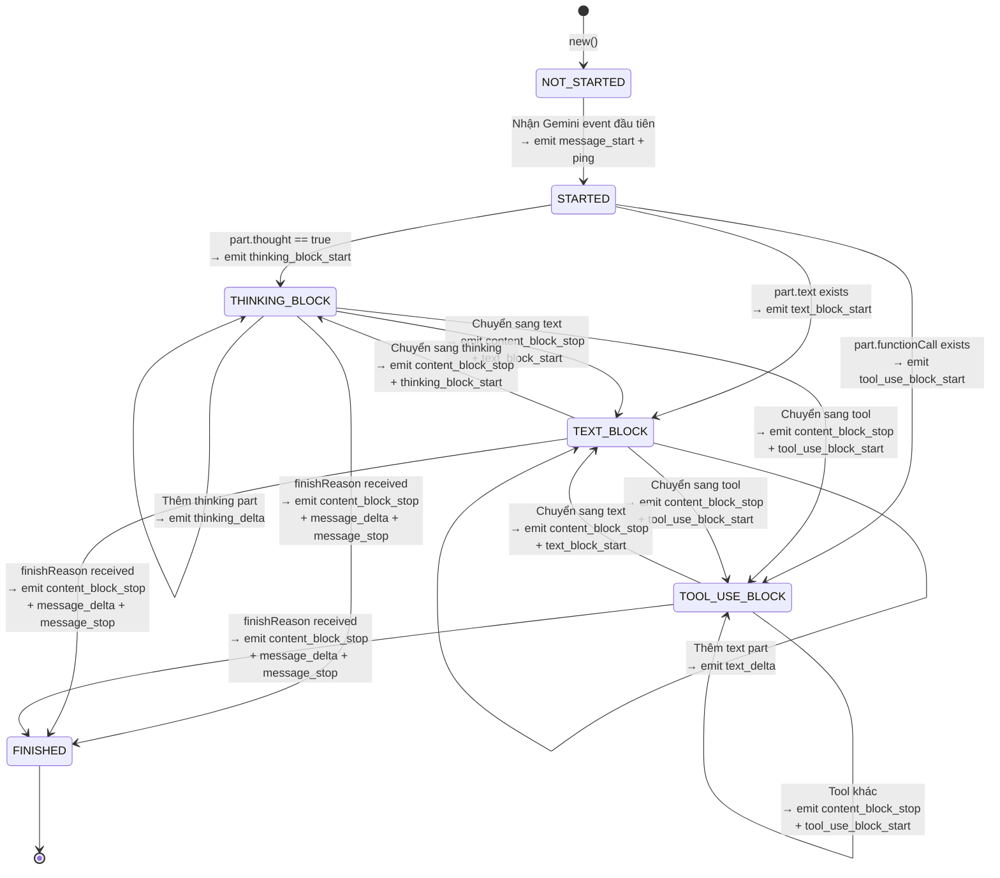

# Anthropic ↔ Gemini Protocol Bridge — Tài Liệu Chi Tiết

Tài liệu mô tả chi tiết kiến trúc, cơ chế hoạt động, cấu trúc source code, và **luồng gọi hàm end-to-end** của module Anthropic Bridge trong proxy server `antigravity-ultra`.

## Bảng Mục Lục

- [1. Tổng Quan Kiến Trúc](#1-tổng-quan-kiến-trúc)
- [2. Sơ Đồ Kiến Trúc Tổng Thể](#2-sơ-đồ-kiến-trúc-tổng-thể)
- [3. File Map — Cấu Trúc Source Code](#3-file-map--cấu-trúc-source-code)
- [4. Luồng Code End-to-End (Caller Context)](#4-luồng-code-end-to-end-caller-context)
- [5. Segment 1 — Request Detection (Nhận Diện Protocol)](#5-segment-1--request-detection-nhận-diện-protocol)
- [6. Segment 2 — Request Transformation (Anthropic → Gemini)](#6-segment-2--request-transformation-anthropic--gemini)
- [7. Segment 3 — Streaming Response (Gemini SSE → Anthropic SSE)](#7-segment-3--streaming-response-gemini-sse--anthropic-sse)
- [8. Segment 4 — Non-Streaming Fallback (Buffer SSE → JSON)](#8-segment-4--non-streaming-fallback-buffer-sse--json)
- [9. Cây Gọi Hàm Tổng Hợp (Complete Call Tree)](#9-cây-gọi-hàm-tổng-hợp-complete-call-tree)
- [10. Data Transformation Examples](#10-data-transformation-examples)
- [11. Unit Tests](#11-unit-tests)

---

## 1. Tổng Quan Kiến Trúc

File `anthropic_bridge.rs` đóng vai trò là một **Protocol Bridge (Cầu nối giao thức)** giữa chuẩn API của Anthropic (Messages API) và chuẩn API nội bộ của Gemini (Gemini v1internal).

**3 nhiệm vụ chính:**

| # | Nhiệm vụ | Mô tả |
|---|----------|-------|
| 1 | **Detection** | Xác định request có phải Anthropic format không (qua headers + body heuristics) |
| 2 | **Request Transform** | Chuyển đổi Anthropic Messages API body → Gemini v1internal format |
| 3 | **Response Transform** | Dịch Gemini SSE stream / JSON → Anthropic SSE events / JSON response |

**Vị trí trong hệ thống:**

```
Client (Anthropic SDK / Claude Code)
    │
    ▼
┌──────────────────────────────────────────┐
│ mod.rs — handle_chat_completions()       │  ← Entry point (Axum route handler)
│   ├── is_anthropic_format() ─────────────│──→ Detection
│   ├── detect_stream() ───────────────────│──→ Stream detection
│   ├── transform_anthropic_to_gemini() ───│──→ Request transformation
│   │                                      │
│   │   [HTTP POST to Gemini v1internal]   │
│   │                                      │
│   ├── create_anthropic_sse_stream() ─────│──→ Streaming response bridge
│   └── buffer_sse_to_anthropic_response()─│──→ Non-streaming response bridge
└──────────────────────────────────────────┘
    │
    ▼
Gemini v1internal API (Google Cloud)
```

---

## 2. Sơ Đồ Kiến Trúc Tổng Thể

### 2.1. Sequence Diagram — Luồng Streaming

```mermaid
sequenceDiagram
    participant C as Client<br/>(Anthropic SDK)
    participant H as handle_chat_completions()<br/>(mod.rs)
    participant D as Detection<br/>(anthropic_bridge.rs)
    participant T as Request Transform<br/>(anthropic_bridge.rs)
    participant G as Gemini v1internal API
    participant S as SSE Converter<br/>(AnthropicSseConverter)

    C->>H: POST /v1/messages<br/>{"model":"claude-opus-4-6","stream":true,...}
    
    H->>H: extract_api_key(headers)<br/>validate_token()
    H->>H: serde_json::from_str(body)
    H->>H: map_model_name("claude-opus-4-6")
    
    rect rgb(40, 40, 70)
        Note over H,D: Phase 1: Detection
        H->>D: is_anthropic_format(body_json, headers)
        D-->>H: true
        H->>D: detect_stream(body_json, headers)
        D-->>H: true
    end
    
    rect rgb(40, 70, 40)
        Note over H,T: Phase 2: Request Transform
        H->>H: token_manager.get_next_account()
        H->>T: transform_anthropic_to_gemini(body, model, account)
        Note over T: 1. Build tool_id→name HashMap<br/>2. Convert messages → contents<br/>3. Extract system instruction<br/>4. Build generation config<br/>5. Convert tools → functionDeclarations<br/>6. Generate session ID (FNV-1a)<br/>7. Build inner request (stable ordering)<br/>8. Wrap with project/model/requestId
        T-->>H: Gemini v1internal JSON body
    end
    
    rect rgb(70, 40, 40)
        Note over H,G: Phase 3: Upstream Call
        H->>H: Build URL: base:streamGenerateContent?alt=sse
        H->>G: POST with Bearer token + headers
        Note over H,G: Retry logic: 3 URLs × 2 passes × 3 accounts
        G-->>H: 200 OK + SSE stream
    end
    
    rect rgb(70, 70, 40)
        Note over H,S: Phase 4: Response Transform
        H->>S: create_anthropic_sse_stream(response, model)
        S->>S: AnthropicSseConverter::new()
        
        loop Mỗi chunk từ upstream
            G-->>S: raw bytes chunk
            S->>S: process_chunk(bytes)
            S->>S: line_buffer += text
            S->>S: Tìm boundary "\n\n"
            S->>S: process_gemini_event(data_json)
            S-->>C: event: message_start<br/>event: content_block_start<br/>event: content_block_delta<br/>...
        end
        
        S->>S: Finalizer (đảm bảo message_stop)
        S-->>C: event: message_delta<br/>event: message_stop
    end
```



### 2.2. State Machine Diagram — AnthropicSseConverter



---

## 3. File Map — Cấu Trúc Source Code

```
src/proxy/
├── mod.rs                  ← Entry point: Router, handle_chat_completions(), model mapping
├── anthropic_bridge.rs     ← Protocol bridge (1351 dòng, file chính của tài liệu này)
└── token_manager.rs        ← Round-robin account pool, token refresh
```

**Phân đoạn logic bên trong `anthropic_bridge.rs`:**

| Dòng | Segment | Nội dung |
|------|---------|----------|
| L1–11 | Imports | `bytes::Bytes`, `futures::stream`, `serde_json`, `HashMap` |
| L12–98 | **Segment 1: Detection** | `is_anthropic_format()`, `detect_stream()` |
| L99–516 | **Segment 2: Request Transform** | `transform_anthropic_to_gemini()` và các helper |
| L517–1010 | **Segment 3: Streaming Response** | `AnthropicSseConverter` state machine, `create_anthropic_sse_stream()` |
| L1011–1285 | **Segment 4: Non-Streaming** | `buffer_sse_to_anthropic_response()`, `create_anthropic_response()` |
| L1287–1351 | Unit Tests | 5 test functions |

---

## 4. Luồng Code End-to-End (Caller Context)

Dưới đây là **luồng code chi tiết theo từng dòng** bắt đầu từ khi request đi vào `mod.rs` cho đến khi response trả về client.

### 4.1. Entry Point — `handle_chat_completions()` (mod.rs L133–492)

```rust
// mod.rs L63–68: Hai route cùng trỏ vào 1 handler
.route("/v1/chat/completions", post(handle_chat_completions))  // OpenAI compat
.route("/v1/messages", post(handle_chat_completions))          // Anthropic compat
```

**Bước 1 — Validate API Key** (mod.rs L141–166):
```
headers → extract_api_key() → user_token::validate_token() → OK / UNAUTHORIZED
```
- Kiểm tra `Authorization: Bearer sk-xxx` hoặc `x-api-key: sk-xxx`
- Nếu token hết hạn hoặc sai → trả 401 ngay lập tức

**Bước 2 — Parse Body & Detect Protocol** (mod.rs L168–196):
```rust
let body_json: Value = serde_json::from_str(&body);       // Parse JSON
let raw_model = body_json["model"];                        // Lấy model name
let model = map_model_name(raw_model);                     // Map: "claude-opus-4" → "claude-opus-4-6-thinking"
let is_anthropic = anthropic_bridge::is_anthropic_format(&body_json, &headers);  // ← BRIDGE CALL #1
let is_stream = anthropic_bridge::detect_stream(&body_json, &headers);           // ← BRIDGE CALL #2
```

**Bước 3 — Account Retry Loop** (mod.rs L198–463):
```
for account_attempt in 0..3 {
    account = token_manager.get_next_account()  // Round-robin từ pool
    
    // Bước 4: Transform request
    let gemini_body = if is_anthropic {
        anthropic_bridge::transform_anthropic_to_gemini(&body_json, &model, &account)  // ← BRIDGE CALL #3
    } else {
        transform_openai_to_gemini(&body_json, &model, &account)
    };
    
    // Bước 5: Build upstream URL
    let url = "{base}:streamGenerateContent?alt=sse"  // Luôn dùng streaming cho Anthropic
    
    // Bước 6: Try 3 endpoints × 2 passes (with/without project header)
    for pass in 0..2 {
        for base_url in [sandbox, daily, prod] {
            let resp = http_client.post(url)
                .header("Authorization", format!("Bearer {}", account.token.access_token))
                .header("x-goog-user-project", project_id)      // Pass 0: có header này
                .header("anthropic-beta", "claude-code-20250219") // Nếu là Claude model
                .body(body_str)
                .send().await;
            
            match resp.status() {
                403 SERVICE_DISABLED → skip_project_header = true, break  // → pass 1
                403 other           → continue (try next endpoint)
                404 / 5xx           → continue (try next endpoint)  
                429                 → continue (try next endpoint, all_429 tracking)
                200                 → SUCCESS! → Branch vào response handling ↓
            }
        }
    }
    
    if all_429 → continue (try next account)
}
```

**Bước 7 — Response Handling** (mod.rs L380–434):
```rust
if is_anthropic {
    if is_stream {
        // ← BRIDGE CALL #4: Streaming
        let body = anthropic_bridge::create_anthropic_sse_stream(resp, raw_model);
        return Response::builder()
            .header("content-type", "text/event-stream")
            .body(body);
    } else {
        // ← BRIDGE CALL #5: Non-streaming (buffer internally)
        let anthropic_resp = anthropic_bridge::buffer_sse_to_anthropic_response(resp, raw_model).await;
        return Response::builder()
            .header("content-type", "application/json")
            .body(serde_json::to_string(&anthropic_resp));
    }
}
```

---

## 5. Segment 1 — Request Detection (Nhận Diện Protocol)

### 5.1. `is_anthropic_format()` (L22–76)

**Mục đích:** Phân biệt Anthropic request vs OpenAI request — cùng handler xử lý cả hai.

**Luồng kiểm tra (ưu tiên headers trước vì nhanh nhất):**

```
Bước 1: Check headers (fast path)
  ├── headers["anthropic-version"] exists?           → return true
  ├── headers["x-api-key"] exists && no "authorization"? → return true
  ├── headers["x-stainless-stream-helper"] exists?   → return true
  └── headers["x-stainless-helper-method"] exists?   → return true

Bước 2: Check body structure (slower path)  
  ├── body["system"] exists?                         → return true
  │     (Anthropic đặt system ở root, OpenAI đặt trong messages)
  │
  ├── body["max_tokens"] + body["messages"] + NO body["response_format"]?
  │   └── messages[0]["content"] is array?            → return true
  │       (Anthropic content = [{type: "text", text: "..."}], OpenAI content = "string")
  │
  └── body["tools"][0]["input_schema"] exists?        → return true
      (Anthropic dùng "input_schema", OpenAI dùng "parameters")

→ return false  (Không match bất kỳ heuristic nào → coi là OpenAI format)
```

### 5.2. `detect_stream()` (L86–97)

```
body["stream"] == true?  → return true
headers["x-stainless-stream-helper"] exists?  → return true
→ return false
```

---

## 6. Segment 2 — Request Transformation (Anthropic → Gemini)

### 6.1. `transform_anthropic_to_gemini()` (L105–260) — Hàm chính

**Input:** Anthropic Messages API body + model name + account info
**Output:** Gemini v1internal JSON body

**Luồng xử lý 8 bước:**

```
Bước 1: Build tool_id→name HashMap (L116–137)
  Scan TẤT CẢ messages có role="assistant", tìm content blocks type="tool_use"
  Thu thập: tool_use.id → tool_use.name
  Ví dụ: {"toolu_abc123" → "list_dir", "toolu_def456" → "grep_search"}
  MỤC ĐÍCH: Gemini yêu cầu functionResponse.name = tên hàm thật,
             KHÔNG PHẢI tool_use_id của Anthropic

Bước 2: Convert messages → Gemini contents (L140–158)
  Gọi extract_parts_from_anthropic_message() cho mỗi message
  Map role: "assistant" → "model", mọi thứ khác → "user"

Bước 3: Extract system instruction (L161)
  Gọi extract_system_instruction(body)

Bước 4: Build generation config (L164–189)
  Map: max_tokens → maxOutputTokens
       temperature → temperature  
       top_p → topP
       thinking.budget_tokens → thinkingConfig.thinkingBudget
  ĐẶC BIỆT: Nếu maxOutputTokens <= thinkingBudget → maxOutputTokens = thinkingBudget + 8000

Bước 5: Convert tools (L192)
  Gọi convert_anthropic_tools(body)

Bước 6: Generate session ID (L195–202)
  FNV-1a hash của account.id → hex string

Bước 7: Build inner request với STABLE FIELD ORDERING (L206–237)
  Thứ tự: systemInstruction → tools → toolConfig → generationConfig → safetySettings → sessionId → contents
  LÝ DO: Gemini có prefix caching — fields ổn định đặt trước để tận dụng cache hit

Bước 8: Final wrapper (L248–257)
  {
    "project": project_id,
    "request": inner_request,
    "model": model,
    "userAgent": "jetski" | "antigravity",  // enterprise vs personal Gmail
    "requestType": "agent",
    "requestId": "agent/{timestamp_ms}/{random_8hex}",
    "enabledCreditTypes": ["GOOGLE_ONE_AI"]
  }
```

### 6.2. `extract_parts_from_anthropic_message()` (L268–396)

**Input:** Một Anthropic message object + tool_id_to_name map
**Output:** Vec<Value> — mảng Gemini parts

**Xử lý theo kiểu content:**

```
msg.content = String("Hello")
  → [{"text": "Hello"}]

msg.content = Array([...blocks...])
  → Duyệt từng block theo block.type:
  
  "text"        → {"text": block.text}  (bỏ qua nếu text rỗng)
  "thinking"    → {"thought": true, "text": block.thinking}
  "tool_use"    → {"functionCall": {"name": block.name, "args": block.input, "id": block.id}}
  "tool_result" → {"functionResponse": {"name": LOOKUP(tool_use_id), "id": tool_use_id, "response": {"result": content, "error": is_error}}}
  "image"       → {"inlineData": {"mimeType": media_type, "data": base64_data}}
  _             → {"text": block.text}  (fallback)
```

**Chi tiết xử lý `tool_result` (CRITICAL):**
```
1. Lấy tool_use_id từ block
2. Lookup tool_id_to_name[tool_use_id] → function_name thật
   VÍ DỤ: "toolu_abc123" → "list_dir"
3. Nếu không tìm thấy → log warning, dùng tool_use_id as-is
4. Extract content:
   - String → dùng trực tiếp
   - Array → gom text blocks, join("\n")
   - _ → empty string
5. Đọc is_error flag (default false)
```

### 6.3. `extract_system_instruction()` (L400–429)

```
body["system"] = String("You are helpful")
  → {"role": "user", "parts": [{"text": "You are helpful"}]}

body["system"] = Array([{type: "text", text: "part1"}, {type: "text", text: "part2"}])
  → {"role": "user", "parts": [{"text": "part1"}, {"text": "part2"}]}

body["system"] missing
  → None (không inject systemInstruction)
```

### 6.4. `convert_anthropic_tools()` (L479–516)

```
Input Anthropic format:
[{"name": "grep_search", "description": "...", "input_schema": {"type": "object", "properties": {...}}}]

Output Gemini format:
[{"functionDeclarations": [{"name": "grep_search", "description": "...", "parameters": {...}}]}]

Bước quan trọng: Gọi strip_unsupported_schema_fields() trên mỗi parameters
```

### 6.5. `strip_unsupported_schema_fields()` (L446–466) — Đệ quy

**Duyệt đệ quy** toàn bộ JSON tree và xóa 25+ fields mà Gemini không hỗ trợ:

```
Loại bỏ: $schema, $id, $ref, $comment, propertyNames, const, 
         exclusiveMinimum, exclusiveMaximum, if, then, else,
         allOf, anyOf, oneOf, not, patternProperties, additionalItems,
         contains, dependencies, contentMediaType, contentEncoding,
         examples, default, readOnly, writeOnly, minContains, maxContains,
         deprecated, $defs, definitions
```

---

## 7. Segment 3 — Streaming Response (Gemini SSE → Anthropic SSE)

### 7.1. `AnthropicSseConverter` Struct (L523–551)

```rust
struct AnthropicSseConverter {
    model: String,              // Model name (trả lại cho client)
    message_id: String,         // "msg_" + 24-char UUID (sinh 1 lần duy nhất)
    content_index: usize,       // Index tăng dần cho mỗi content block (0, 1, 2, ...)
    started: bool,              // Đã emit message_start chưa?
    total_input_tokens: u64,    // Cập nhật từ usageMetadata
    total_output_tokens: u64,   // Cập nhật từ usageMetadata
    has_tool_use: bool,         // Có bất kỳ functionCall nào không? (ảnh hưởng stop_reason)
    line_buffer: String,        // Buffer bytes chưa hoàn chỉnh (chờ \n\n)
    current_block_type: Option<String>,  // None | "text" | "thinking" | "tool_use"
}
```

### 7.2. Event Emitter Methods

Mỗi method sinh ra **đúng 1 SSE event string** theo format Anthropic:

| Method | Anthropic Event | Format |
|--------|----------------|--------|
| `message_start()` | `event: message_start` | `{type, message: {id, role, content: [], model, usage}}` |
| `ping()` | `event: ping` | `{type: "ping"}` |
| `text_block_start()` | `event: content_block_start` | `{type, index, content_block: {type: "text", text: ""}}` |
| `thinking_block_start()` | `event: content_block_start` | `{type, index, content_block: {type: "thinking", thinking: ""}}` |
| `tool_use_block_start()` | `event: content_block_start` | `{type, index, content_block: {type: "tool_use", id, name, input: {}}}` |
| `text_delta()` | `event: content_block_delta` | `{type, index, delta: {type: "text_delta", text}}` |
| `thinking_delta()` | `event: content_block_delta` | `{type, index, delta: {type: "thinking_delta", thinking}}` |
| `tool_use_delta()` | `event: content_block_delta` | `{type, index, delta: {type: "input_json_delta", partial_json}}` |
| `content_block_stop()` | `event: content_block_stop` | `{type, index}` — **tăng content_index += 1** |
| `message_delta()` | `event: message_delta` | `{type, delta: {stop_reason}, usage: {output_tokens}}` |
| `message_stop()` | `event: message_stop` | `{type: "message_stop"}` |

### 7.3. `process_chunk()` (L853–897) — Line Buffering

```
Input: raw bytes từ reqwest byte_stream
Output: Vec<String> — danh sách Anthropic SSE events

Luồng:
1. UTF-8 decode bytes → text
2. Append vào line_buffer
3. Loop: tìm boundary "\n\n" hoặc "\r\n\r\n" trong line_buffer
4. Khi tìm thấy boundary:
   a. Tách event_text = line_buffer[..pos]
   b. Cắt line_buffer = line_buffer[pos+sep_len..]
   c. Parse từng dòng trong event_text:
      - Tìm dòng bắt đầu "data:" 
      - Bỏ qua "[DONE]" và dòng trống
      - Gọi process_gemini_event(data_json) → collect events
5. Nếu không còn boundary → break (giữ remaining trong buffer cho chunk tiếp theo)
```

### 7.4. `process_gemini_event()` (L718–848) — Core Event Translation

**Input:** 1 JSON string từ Gemini SSE `data:` line
**Output:** Vec<String> — 0..N Anthropic SSE events

```
Luồng chi tiết:

1. Parse JSON string → Value
2. Unwrap wrapper: parsed["response"] hoặc parsed trực tiếp
3. Extract usageMetadata → cập nhật total_input_tokens, total_output_tokens

4. Lần đầu tiên (started == false):
   → emit message_start(input_tokens)
   → emit ping()
   → set started = true

5. Duyệt candidates[].content.parts[]:
   Cho MỖI part:
   
   ┌─ part.thought == true && part.text exists
   │  IF current_block_type != "thinking":
   │     IF current_block_type.is_some() → emit content_block_stop()
   │     emit thinking_block_start()
   │     set current_block_type = "thinking"
   │  emit thinking_delta(text)
   │
   ├─ part.text exists (no thought flag)
   │  IF current_block_type != "text":
   │     IF current_block_type.is_some() → emit content_block_stop()
   │     emit text_block_start()
   │     set current_block_type = "text"
   │  emit text_delta(text)
   │
   └─ part.functionCall exists
      IF current_block_type.is_some() → emit content_block_stop()
      Generate tool_id = "toolu_" + 24-char UUID
      emit tool_use_block_start(tool_id, name)
      Serialize args → JSON string
      emit tool_use_delta(args_json)
      set current_block_type = "tool_use"

6. Check finishReason:
   IF finishReason exists ("STOP", "MAX_TOKENS", "SAFETY"):
     IF current_block_type.is_some() → emit content_block_stop()
     set current_block_type = None
     Map finish reason:
       "STOP"       → if has_tool_use then "tool_use" else "end_turn"
       "MAX_TOKENS"  → "max_tokens"
       _            → "end_turn"
     emit message_delta(stop_reason, output_tokens)
     emit message_stop()
```

### 7.5. `create_anthropic_sse_stream()` (L904–1010) — Stream Wrapper + Finalizer

```
Input: reqwest::Response (SSE stream từ Gemini)
Output: axum::body::Body (SSE stream sang Client)

Luồng:
1. Tạo AnthropicSseConverter::new(model)
2. async_stream::stream! macro:
   while let Some(chunk) = byte_stream.next().await {
     Ok(chunk) → converter.process_chunk(&chunk) → yield events
     Err(e) → yield error event → break
   }

3. POST-STREAM FINALIZER (Critical cho Anthropic SDK compatibility):

   CASE A: converter.started == false
     Stream hết mà không parse được event nào từ Gemini
     → Emit toàn bộ minimal response:
       message_start(0) → ping → text_block_start → text_delta("") →
       content_block_stop → message_delta("end_turn", 0) → message_stop
     
   CASE B: converter.current_block_type.is_some()
     Stream kết thúc nhưng block đang mở (Gemini không gửi finishReason)
     → content_block_stop → message_delta → message_stop
     
   CASE C-1: converter.content_index == 0
     Started nhưng không có content block nào (chỉ nhận usage metadata)
     → text_block_start → text_delta("") → content_block_stop → message_delta → message_stop
     
   CASE C-2: content_index > 0 && current_block_type == None && started
     finishReason đã được xử lý → stream đã terminate đúng
     → Không làm gì thêm

   TẠI SAO CẦN FINALIZER?
   Anthropic SDK (get_final_message()) assert rằng __final_message_snapshot != None.
   Nếu thiếu message_stop → SDK crash/hang. Finalizer đảm bảo 100% stream có kết thúc hợp lệ.
```

---

## 8. Segment 4 — Non-Streaming Fallback (Buffer SSE → JSON)

### 8.1. `buffer_sse_to_anthropic_response()` (L1016–1190)

**Context:** Client gửi request non-streaming, nhưng proxy vẫn gọi `streamGenerateContent?alt=sse` lên Gemini (vì `generateContent` trả 500 cho một số model). Hàm này **gom toàn bộ SSE stream thành 1 JSON response**.

```
Input: reqwest::Response (SSE stream)
Output: Value (Anthropic JSON response)

Luồng:
1. Khởi tạo accumulators:
   - content_blocks: Vec<Value>    — danh sách blocks hoàn chỉnh
   - current_text: String          — buffer text đang tích lũy
   - current_thinking: String      — buffer thinking đang tích lũy
   - line_buffer: String           — SSE line buffer (giống process_chunk)

2. while let Some(chunk) = byte_stream.next().await:
   a. Append text vào line_buffer
   b. Tìm SSE boundary "\n\n"
   c. Parse "data:" lines → JSON
   d. Unwrap response wrapper
   e. Cập nhật usage tokens
   f. Duyệt candidates[].content.parts[]:
   
      thought == true:
        - Flush current_text → push {type: "text", text} vào content_blocks
        - Append vào current_thinking
      
      text (no thought):
        - Flush current_thinking → push {type: "thinking", thinking} vào content_blocks
        - Append vào current_text
      
      functionCall:
        - Flush cả current_thinking và current_text
        - Push {type: "tool_use", id: "toolu_xxx", name, input: args}
        - set has_tool_use = true
   
   g. Check finishReason → map stop_reason

3. Sau khi stream kết thúc:
   - Flush remaining current_thinking → push thinking block
   - Flush remaining current_text → push text block

4. Return JSON:
   {
     "id": "msg_xxx",
     "type": "message",
     "role": "assistant",
     "content": content_blocks,
     "model": model,
     "stop_reason": stop_reason,
     "stop_sequence": null,
     "usage": { "input_tokens": N, "output_tokens": M }
   }
```

**So sánh với streaming converter:**

| Aspect | `create_anthropic_sse_stream` | `buffer_sse_to_anthropic_response` |
|--------|------------------------------|-----------------------------------|
| Output | Chuỗi SSE events liên tục | 1 JSON object cuối cùng |
| Latency | Thấp (stream từng token) | Cao (chờ hết stream) |
| Memory | Thấp (emit và quên) | Cao hơn (buffer toàn bộ text/thinking) |
| Use case | `stream: true` | `stream: false` (nhưng upstream vẫn dùng SSE) |
| Finalizer | Cần (đảm bảo message_stop) | Không cần (build JSON cuối) |

### 8.2. `create_anthropic_response()` (L1192–1285) — Static JSON Transform

**Input:** Gemini JSON body string (non-streaming response trực tiếp)
**Output:** Anthropic JSON response

**Đơn giản hơn nhiều** — chỉ duyệt `candidates[].content.parts[]` 1 lần và map thẳng sang content_blocks. Không cần line buffering hay SSE parsing.

```
Duyệt parts:
  thought == true + text → {type: "thinking", thinking: text}
  text                   → {type: "text", text: text}  
  functionCall           → {type: "tool_use", id: "toolu_xxx", name, input: args}
```

---

## 9. Cây Gọi Hàm Tổng Hợp (Complete Call Tree)

```text
mod.rs::handle_chat_completions()                        ← ENTRY POINT (L133)
│
├── extract_api_key(headers)                              (L704)
├── user_token::validate_token(key, ip)                   (L143)
├── serde_json::from_str(body)                            (L169)
├── map_model_name(raw_model)                             (L744) 
│   └── Match table: claude-sonnet/opus → internal names
│
├── anthropic_bridge::is_anthropic_format(body, headers)  (L22)  ← BRIDGE
│   ├── Check 4 header heuristics
│   └── Check 3 body structure heuristics
│
├── anthropic_bridge::detect_stream(body, headers)         (L86)  ← BRIDGE
│
├── token_manager.get_next_account()                       (L85)
│   ├── Round-robin selection (atomic index)
│   └── Auto-refresh if token expires within 900s
│
├── anthropic_bridge::transform_anthropic_to_gemini()      (L105) ← BRIDGE
│   ├── [Pass 1] Build tool_id→name HashMap                (L116)
│   │   └── Scan all assistant messages for tool_use blocks
│   │
│   ├── [Loop] extract_parts_from_anthropic_message()      (L268)
│   │   ├── Handle String content                          (L272)
│   │   └── Handle Array content blocks                    (L275)
│   │       ├── "text" → {text}                            (L279)
│   │       ├── "thinking" → {thought: true, text}         (L289)
│   │       ├── "tool_use" → {functionCall: {name, args, id}} (L296)
│   │       ├── "tool_result" → {functionResponse: {name: LOOKUP(), id, response}} (L314)
│   │       ├── "image" → {inlineData: {mimeType, data}}  (L367)
│   │       └── _ → {text} fallback                        (L383)
│   │
│   ├── extract_system_instruction(body)                   (L400)
│   │   ├── String → {role: "user", parts: [{text}]}
│   │   └── Array → filter type="text", collect parts
│   │
│   ├── convert_anthropic_tools(body)                      (L479)
│   │   ├── Map input_schema → parameters
│   │   └── strip_unsupported_schema_fields(params)        (L446) ← RECURSIVE
│   │       ├── Remove 25+ unsupported JSON Schema fields
│   │       └── Recurse into nested objects/arrays
│   │
│   ├── FNV-1a hash → session_id                          (L195)
│   ├── Build inner_request (stable field ordering)        (L206)
│   └── Wrap with project/model/requestId/enabledCreditTypes (L248)
│
├── [HTTP POST] → Gemini v1internal API                    (L310)
│   └── Retry: 3 endpoints × 2 passes × 3 accounts
│       ├── 403 SERVICE_DISABLED → mark_skip_project_header, retry
│       ├── 429 RATE_LIMITED → try next endpoint/account
│       ├── 404/5xx → try next endpoint
│       └── 200 OK → proceed to response handling
│
├── [if is_anthropic && is_stream]
│   └── anthropic_bridge::create_anthropic_sse_stream()    (L904) ← BRIDGE
│       ├── AnthropicSseConverter::new(model)               (L538)
│       ├── [Loop] byte_stream.next().await
│       │   └── AnthropicSseConverter::process_chunk()      (L853)
│       │       ├── UTF-8 decode
│       │       ├── Append to line_buffer
│       │       ├── [Loop] Find "\n\n" boundary
│       │       └── [Each event] process_gemini_event()     (L718)
│       │           ├── serde_json::from_str(data_json)
│       │           ├── Unwrap response wrapper
│       │           ├── Update usage tokens
│       │           ├── [First time] message_start() + ping()
│       │           ├── [Each part] Block transition logic
│       │           │   ├── thinking → thinking_block_start + thinking_delta
│       │           │   ├── text → text_block_start + text_delta
│       │           │   └── functionCall → tool_use_block_start + tool_use_delta
│       │           └── [finishReason] content_block_stop + message_delta + message_stop
│       │
│       └── [Finalizer] Guarantee message_stop              (L948)
│           ├── CASE A: Never started → emit full minimal response
│           ├── CASE B: Open block → close + stop
│           ├── CASE C-1: No blocks → emit minimal + stop
│           └── CASE C-2: Properly terminated → no-op
│
├── [if is_anthropic && !is_stream]
│   └── anthropic_bridge::buffer_sse_to_anthropic_response() (L1016) ← BRIDGE
│       ├── [Loop] byte_stream.next().await
│       │   ├── SSE line buffering (same as process_chunk)
│       │   └── [Each event] Parse Gemini JSON
│       │       ├── Update usage tokens
│       │       ├── Accumulate text into current_text String
│       │       ├── Accumulate thinking into current_thinking String
│       │       └── Push functionCall directly into content_blocks
│       ├── Flush remaining text/thinking buffers
│       └── Return single Anthropic JSON response
│
└── [Error: All endpoints failed]
    └── Return 502 Bad Gateway with error JSON               (L466)
```

---

## 10. Data Transformation Examples

### 10.1. Request Transform: Anthropic → Gemini

**Input (Anthropic Messages API):**
```json
{
  "model": "claude-opus-4-6-thinking",
  "max_tokens": 16384,
  "temperature": 1,
  "thinking": {"type": "enabled", "budget_tokens": 10000},
  "system": "You are a helpful assistant.",
  "tools": [
    {"name": "list_dir", "description": "List directory", "input_schema": {"type": "object", "properties": {"path": {"type": "string"}}, "required": ["path"]}}
  ],
  "messages": [
    {"role": "user", "content": "List /tmp"},
    {"role": "assistant", "content": [
      {"type": "thinking", "thinking": "I should use list_dir tool..."},
      {"type": "tool_use", "id": "toolu_abc123", "name": "list_dir", "input": {"path": "/tmp"}}
    ]},
    {"role": "user", "content": [
      {"type": "tool_result", "tool_use_id": "toolu_abc123", "content": "file1.txt\nfile2.txt"}
    ]}
  ]
}
```

**Output (Gemini v1internal):**
```json
{
  "project": "project-123",
  "model": "claude-opus-4-6-thinking",
  "userAgent": "antigravity",
  "requestType": "agent",
  "requestId": "agent/1723960800000/a1b2c3d4",
  "enabledCreditTypes": ["GOOGLE_ONE_AI"],
  "request": {
    "systemInstruction": {"role": "user", "parts": [{"text": "You are a helpful assistant."}]},
    "tools": [{"functionDeclarations": [{"name": "list_dir", "description": "List directory", "parameters": {"type": "object", "properties": {"path": {"type": "string"}}, "required": ["path"]}}]}],
    "toolConfig": {"functionCallingConfig": {"mode": "VALIDATED"}},
    "generationConfig": {"maxOutputTokens": 18000, "temperature": 1, "thinkingConfig": {"thinkingBudget": 10000}},
    "safetySettings": [{"category": "HARM_CATEGORY_HARASSMENT", "threshold": "OFF"}, "...3 more"],
    "sessionId": "a1b2c3d4e5f6g7h8",
    "contents": [
      {"role": "user", "parts": [{"text": "List /tmp"}]},
      {"role": "model", "parts": [
        {"thought": true, "text": "I should use list_dir tool..."},
        {"functionCall": {"name": "list_dir", "args": {"path": "/tmp"}, "id": "toolu_abc123"}}
      ]},
      {"role": "user", "parts": [
        {"functionResponse": {"name": "list_dir", "id": "toolu_abc123", "response": {"result": "file1.txt\nfile2.txt", "error": false}}}
      ]}
    ]
  }
}
```

### 10.2. Response Transform: Gemini SSE → Anthropic SSE

**Gemini SSE event:**
```
data: {"response":{"candidates":[{"content":{"parts":[{"thought":true,"text":"Let me think..."}]},"finishReason":null}],"usageMetadata":{"promptTokenCount":500,"candidatesTokenCount":10}}}
```

**Anthropic SSE events generated:**
```
event: message_start
data: {"type":"message_start","message":{"id":"msg_abc...","type":"message","role":"assistant","content":[],"model":"claude-opus-4-6-thinking","stop_reason":null,"stop_sequence":null,"usage":{"input_tokens":500,"output_tokens":1}}}

event: ping
data: {"type":"ping"}

event: content_block_start
data: {"type":"content_block_start","index":0,"content_block":{"type":"thinking","thinking":""}}

event: content_block_delta
data: {"type":"content_block_delta","index":0,"delta":{"type":"thinking_delta","thinking":"Let me think..."}}
```

---

## 11. Unit Tests

| Test | File/Line | Mục đích |
|------|-----------|----------|
| `test_detect_anthropic_format_by_system` | L1292 | Body có `system` field → Anthropic |
| `test_detect_openai_format` | L1299 | Body có `messages[].role=system` → NOT Anthropic |
| `test_detect_anthropic_format_by_tools` | L1306 | Tools dùng `input_schema` → Anthropic |
| `test_extract_system_string` | L1317 | System = string → parsed correctly |
| `test_convert_tools` | L1329 | Tool conversion: `input_schema` → `parameters` |
