# Anthropic ↔ Gemini Protocol Bridge Documentation

Tài liệu này mô tả chi tiết kiến trúc, cơ chế hoạt động và cấu trúc source code của module `anthropic_bridge.rs`. 

## Bảng Mục Lục (Table of Contents)
- [1. Tổng quan (Overview)](#1-tổng-quan-overview)
- [2. Sơ đồ Kiến trúc (Architecture Diagram)](#2-sơ-đồ-kiến-trúc-architecture-diagram)
- [3. Cấu trúc Source Code (Source Structure)](#3-cấu-trúc-source-code-source-structure)
- [4. Map Gọi Hàm (Function Call Tree)](#4-map-gọi-hàm-function-call-tree)
- [5. Chi Tiết Các Cơ Chế Cốt Lõi (Detailed Mechanisms)](#5-chi-tiết-các-cơ-chế-cốt-lõi-detailed-mechanisms)
  - [5.1. Cơ chế nhận diện (Detection Mechanism)](#51-cơ-chế-nhận-diện-detection-mechanism)
  - [5.2. Chuyển đổi cấu trúc Request (Transformation Mechanism)](#52-chuyển-đổi-cấu-trúc-request-transformation-mechanism)
  - [5.3. State Machine cho Streaming (SSE Converter Mechanism)](#53-state-machine-cho-streaming-sse-converter-mechanism)
  - [5.4. Non-Streaming Fallback (Bộ đệm gom Stream)](#54-non-streaming-fallback-bộ-đệm-gom-stream)

---

## 1. Tổng quan (Overview)

File `anthropic_bridge.rs` đóng vai trò là một **Protocol Bridge (Cầu nối giao thức)** giữa chuẩn API của Anthropic (Messages API) và chuẩn API nội bộ của Gemini (Gemini v1internal). 

Nhiệm vụ chính của source này bao gồm:
1. **Nhận diện (Detection):** Xác định xem request gửi tới có phải là định dạng của Anthropic hay không.
2. **Transform Request (Input):** Chuyển đổi format của request body từ Anthropic sang format của Gemini trước khi gửi request tới upstream.
3. **Transform Response (Output):** Nhận stream dữ liệu (SSE) hoặc non-stream từ Gemini, dịch ngược lại thành chuẩn sự kiện của Anthropic để trả về cho Client. Nó xử lý chi tiết các thành phần phức tạp như văn bản (text), tư duy (thinking blocks), và việc gọi hàm (tool use).

---

## 2. Sơ đồ Kiến trúc (Architecture Diagram)

Dưới đây là Sequence Diagram biểu diễn luồng dữ liệu thông qua Protocol Bridge:

```mermaid
sequenceDiagram
    participant C as Client (Anthropic SDK)
    participant B as AnthropicBridge (Proxy)
    participant G as Gemini API

    C->>B: Request (Anthropic format)
    
    rect rgb(30, 30, 50)
        Note over B: 1. Detection Phase
        B->>B: is_anthropic_format(body, headers)
    end
    
    rect rgb(30, 50, 30)
        Note over B: 2. Request Transformation
        B->>B: transform_anthropic_to_gemini(body)
    end
    
    B->>G: Forward Request (Gemini v1internal format)
    
    alt Streaming Request (SSE)
        G-->>B: SSE Stream (Gemini format)
        Note over B: 3. Streaming Response Transformation
        B->>B: create_anthropic_sse_stream()
        loop process_chunk()
            B->>B: AnthropicSseConverter State Machine
            B-->>C: SSE Event (Anthropic format: message_start, content_block_delta, etc.)
        end
        B-->>C: SSE Event (message_stop)
    else Non-Streaming Request
        G-->>B: SSE Stream (Gemini format)
        Note over B: 4. Buffering Fallback
        B->>B: buffer_sse_to_anthropic_response()
        Note right of B: Accumulate chunks in RAM
        B-->>C: Final JSON Response (Anthropic format)
    end
```



---

## 3. Cấu trúc Source Code (Source Structure)

Source code được chia thành 4 phân đoạn (segment) logic rõ ràng:

1. **Request Detection:** Chứa các hàm nhận diện header và cấu trúc body để quyết định áp dụng luồng Anthropic.
2. **Request Transformation (Anthropic → Gemini v1internal):** Phụ trách việc bóc tách system prompt, messages (vai trò user/assistant), cấu hình gen-config, và định nghĩa tool (function schemas) từ Anthropic sang Gemini.
3. **Response Transformation (Gemini SSE → Anthropic SSE):** Phần phức tạp nhất chứa một State Machine (`AnthropicSseConverter`) để xử lý buffer các raw chunk (mảnh dữ liệu) của Gemini và sinh ra tuần tự các sự kiện (events) đúng chuẩn Anthropic (`message_start`, `content_block_start`, `content_block_delta`, `message_delta`, v.v.).
4. **Unit Tests:** Đảm bảo logic nhận diện và biến đổi hoạt động đúng (thông qua module `tests`).

---

## 4. Map Gọi Hàm (Function Call Tree)

Dưới đây là flow map chi tiết biểu diễn cây gọi hàm từ lúc nhận request đến khi trả response:

```text
[Nhận diện Request]
 ├── is_anthropic_format(body, headers) -> bool
 └── detect_stream(body, headers) -> bool

[Chuyển đổi Request: Anthropic -> Gemini]
 └── transform_anthropic_to_gemini(body, model, account) -> Value (JSON)
      ├── extract_system_instruction(body) -> Lấy system prompt
      ├── extract_parts_from_anthropic_message(msg) -> Bóc tách content (text, thinking, tool_use, tool_result, image)
      └── convert_anthropic_tools(body) -> Map input_schema của Anthropic sang functionDeclarations
           └── strip_unsupported_schema_fields(value) -> (Đệ quy) Xóa các trường JSON schema Gemini không hỗ trợ

[Chuyển đổi Response: Streaming (Gemini SSE -> Anthropic SSE)]
 └── create_anthropic_sse_stream(upstream_response, model) -> axum::body::Body
      ├── AnthropicSseConverter::new() -> Khởi tạo state machine
      ├── loop (byte_stream.next()) -> Nhận chunk từ upstream
      │    └── AnthropicSseConverter::process_chunk(chunk) -> Quản lý buffer các line
      │         └── AnthropicSseConverter::process_gemini_event(data_json) -> Dịch 1 event hoàn chỉnh
      │              ├── AnthropicSseConverter::message_start()
      │              ├── AnthropicSseConverter::ping()
      │              ├── AnthropicSseConverter::thinking_block_start() / text_block_start() / tool_use_block_start()
      │              ├── AnthropicSseConverter::thinking_delta() / text_delta() / tool_use_delta()
      │              ├── AnthropicSseConverter::content_block_stop()
      │              └── AnthropicSseConverter::message_delta() & message_stop()
      └── Finalizer Logic (Sau khi stream kết thúc, đảm bảo đóng event theo chuẩn Anthropic)

[Chuyển đổi Response: Non-Streaming / Buffering]
 ├── buffer_sse_to_anthropic_response(upstream_response, model) -> Gom SSE stream của Gemini thành 1 JSON Anthropic
 └── create_anthropic_response(gemini_body, model) -> Dịch 1 JSON response tĩnh của Gemini sang JSON Anthropic
```

---

## 5. Chi Tiết Các Cơ Chế Cốt Lõi (Detailed Mechanisms)

### 5.1. Cơ chế nhận diện (Detection Mechanism)
Hàm `is_anthropic_format` kiểm tra kết hợp giữa **Headers** và **Body**:
- **Headers:** Nếu có các header như `anthropic-version`, `x-stainless-stream-helper`, hoặc dùng `x-api-key` thay vì Authorization token.
- **Body:** Nếu body có key `system` ở ngoài cùng, hoặc có `max_tokens` kết hợp với `messages` nhưng không có `response_format` (chỉ dấu của OpenAI).

### 5.2. Chuyển đổi cấu trúc Request (Transformation Mechanism)
Hàm `transform_anthropic_to_gemini` thực thi quy trình ráp nối request:
1. **System Instruction:** Anthropic để `system` ở ngoài cùng (root). Hàm `extract_system_instruction` nhặt lấy data này đẩy vào `systemInstruction` của Gemini.
2. **Messages Context:** Hàm `extract_parts_from_anthropic_message` map từ `assistant` -> `model` và bóc tách các content block (text, image data, tool request, tool result).
3. **Tools/Functions:** Hàm `convert_anthropic_tools` đổi định dạng `input_schema` của Anthropic sang `parameters` của Gemini. Điểm nổi bật là hàm đệ quy `strip_unsupported_schema_fields` sẽ dọn dẹp các keyword JSON schema mà API nội bộ Gemini không hỗ trợ (ví dụ: `$schema`, `anyOf`, `allOf`, `patternProperties`...).
4. Xây dựng **official_request_id** và xác định **user_agent** (`jetski` hoặc `antigravity`) dựa trên định dạng email account.

### 5.3. State Machine cho Streaming (SSE Converter Mechanism)
Cấu trúc `AnthropicSseConverter` hoạt động như một cỗ máy trạng thái (state machine) vì SSE trả về theo mảnh nhỏ.
- Nó dùng `line_buffer` để gom các byte nhận được (`process_chunk`) cho đến khi gặp ký tự ngắt dòng `\n\n` (tạo thành một sự kiện SSE hoàn chỉnh).
- Tại hàm `process_gemini_event`, parser đọc `candidates` từ Gemini:
    - Nếu phát hiện part là `thought: true` → Đóng block `text` cũ (nếu có), phát sự kiện `content_block_start` (kiểu thinking) và bắn `thinking_delta`.
    - Tương tự cho regular `text` và `functionCall` (`tool_use` event của Anthropic).
- Khi nhận được `finishReason` từ Gemini (như STOP, MAX_TOKENS), nó sẽ kích hoạt việc đóng lại các block và bắn ra `message_delta` (chứa `stop_reason`) cùng `message_stop`.
- Có một block Finalizer riêng biệt bên trong `create_anthropic_sse_stream` để giải quyết các luồng stream bị lỗi lửng hoặc ngắt bất ngờ, đảm bảo client Anthropic SDK luôn nhận được tín hiệu đóng kết nối hợp lệ.

### 5.4. Non-Streaming Fallback (Bộ đệm gom Stream)
Đôi khi client gửi request Non-Streaming, nhưng phía proxy vẫn cố tình gọi stream API lên Gemini (vì một số model Gemini trả lỗi 500 nếu xài non-streaming endpoint). Lúc này, hàm `buffer_sse_to_anthropic_response` sẽ được sử dụng. Cơ chế của nó là âm thầm subscribe luồng byte SSE từ upstream, gom toàn bộ text/thinking/function_call vào RAM (memory buffer), và khi upstream kết thúc, nó sẽ gói lại thành một response JSON duy nhất trả về cho client.
