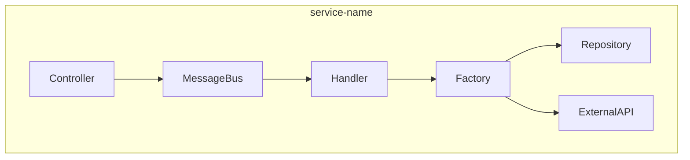

## Architecture Overview

<!-- Tổng quan kiến trúc: services nào, modules nào -->



## Component Mapping

### Handler Selection

| Feature | Base Class | Justification |
|---|---|---|
| | `BaseQueryHandler` / `BaseCommandHandler` / `BaseInitFinancialHandler` / `BaseInitNonFinancialHandler` | |

### Factory Selection

| Factory | Type | Generic Parameters |
|---|---|---|
| | `BaseCrudDataFactory` / `BaseClientDataFactory` / `BaseDataFactory` | `<ID, Model, ID, Entity, Repository>` |

## Entity Design

### [EntityName]Entity

```java
@Entity
@Table(name = "TABLE_NAME")
public class FeatureEntity implements IBaseEntity<Long> {
    // columns
}
```

| Column | Type | DB Column | Constraints |
|---|---|---|---|
| id | Long | ID | PK, auto-increment |
| | | | |

## Cache Strategy

<!-- 
cacheModel: true/false — cache individual model by ID
cacheCollection: true/false — cache list results
ReloadCacheFactoryConstants registration needed?
-->

| Factory | cacheModel | cacheCollection | Reload Constant |
|---|---|---|---|
| | | | |

## API Design

### [POST/GET] /api/v1/{path}
- **Controller**: `App{Feature}Controller extends BaseAppController`
- **Request**: `{Feature}Request extends BaseSessionRequest implements QueryMessage`
- **Response**: `{Feature}Response`
- **Handler**: `{Feature}Handler extends BaseQueryHandler`

**Request:**
```json
{
  "field1": "value"
}
```

**Response:**
```json
{
  "responseCode": "00",
  "responseMessage": "Success",
  "data": {}
}
```

**Validation Rules:**
| Field | Rule | Error Code |
|---|---|---|
| | @NotBlank / @NotNull / @Size(max=N) | |

## Class Specifications

### Request/Response DTOs

```java
@Getter
@SuperBuilder(toBuilder = true)
@NoArgsConstructor(access = AccessLevel.PROTECTED)
public class FeatureRequest extends BaseSessionRequest implements QueryMessage {
    // fields
}
```

```java
@Getter
@SuperBuilder(toBuilder = true)
@NoArgsConstructor(access = AccessLevel.PROTECTED)
@AllArgsConstructor(access = AccessLevel.PROTECTED)
public class FeatureResponse {
    // fields
}
```

### Error Codes

| Code | Enum Value | Message | HTTP |
|---|---|---|---|
| | ErrorCode.BAD_REQUEST | | 400 |

### Repository Queries

```java
public interface FeatureRepository extends ListCrudRepository<FeatureEntity, Long>,
        ListPagingAndSortingRepository<FeatureEntity, Long> {
    // Custom queries
}
```

## Configuration

<!-- Constants, enums, cache reload, etc. -->

## Package Structure

```
{service}/module/{feature}/
├── controller/
│   ├── app/App{Feature}Controller.java
│   └── web/Web{Feature}Controller.java (if needed)
├── handler/{Feature}Handler.java
├── factory/
│   ├── I{Feature}Factory.java
│   └── impl/{Feature}Factory.java
├── model/
│   ├── request/{Feature}Request.java
│   └── response/{Feature}Response.java
│   └── {Feature}Model.java
├── entity/{Feature}Entity.java
└── repository/{Feature}Repository.java
```

## Cross-Service Dependencies

<!-- List dependencies with other services/modules -->

| Dependency | Type | Interface |
|---|---|---|
| | adapter / shared module | |
